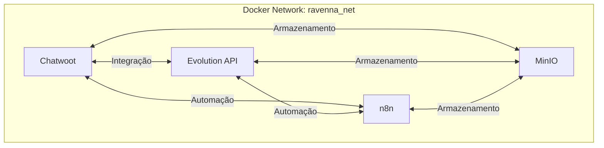

# Ecossistema de Automação com Docker

Este projeto implementa um ecossistema completo de automação utilizando Docker Compose, composto por quatro soluções principais que trabalham em conjunto:

1. **Chatwoot** - Plataforma de atendimento ao cliente
2. **Evolution API** - Integração com WhatsApp
3. **n8n** - Automação de fluxos de trabalho
4. **MinIO** - Armazenamento de objetos

## 🔍 Visão Geral da Arquitetura



## 🚀 Soluções Implementadas

### 1. Chatwoot
**Propósito**: Plataforma de atendimento ao cliente multicanal com suporte a chat, e-mail e redes sociais.

**Componentes**:
- **Aplicação Rails**: Interface web principal
- **PostgreSQL com pgvector**: Armazenamento de dados e buscas vetoriais
- **Redis**: Cache e gerenciamento de filas
- **Nginx**: Servidor web reverso

### 2. Evolution API
**Propósito**: API robusta para integração com WhatsApp, permitindo envio e recebimento de mensagens.

**Recursos Principais**:
- Autenticação via chave de API
- Suporte a múltiplas instâncias
- Webhooks para eventos em tempo real
- Armazenamento de mídia

### 3. n8n
**Propósito**: Plataforma de automação de fluxo de trabalho com interface visual.

**Funcionalidades**:
- Integração com diversos serviços
- Automação de tarefas
- Agendamento de rotinas
- Manipulação de dados

### 4. MinIO
**Propósito**: Armazenamento de objetos compatível com Amazon S3 para armazenar mídias e arquivos do ecossistema.

**Recursos Principais**:
- Interface web intuitiva (Console MinIO)
- Compatível com a API S3
- Armazenamento altamente escalável
- Suporte a políticas de acesso granulares

**Portas**:
- API: 9000
- Console Web: 9001

## 🛠️ Guia de Instalação

### Pré-requisitos
- Docker 20.10+
- Docker Compose 2.0+
- 4GB de RAM (mínimo)
- 2 vCPUs (mínimo)
- Pelo menos 10GB de espaço em disco para armazenamento

### Passo 1: Configuração Inicial

1. Clone o repositório:
   ```bash
   git clone [URL_DO_REPOSITÓRIO]
   cd ProjetoHavoc
   ```

2. Crie a rede Docker compartilhada:
   ```bash
   docker network create ravenna_net
   ```

### Passo 2: Configuração dos Serviços

#### MinIO (Recomendado instalar primeiro)
1. Navegue até a pasta do MinIO:
   ```bash
   cd minio
   ```

2. Crie o arquivo `.minio.env` com as credenciais:
   ```env
   MINIO_ROOT_USER=admin
   MINIO_ROOT_PASSWORD=senha_muito_forte
   MINIO_SERVER_URL=http://localhost:9000
   MINIO_CONSOLE_ADDRESS=":9001"
   ```

3. Inicie o MinIO:
   ```bash
   docker-compose up -d
   ```

4. Acesse o console web em `http://localhost:9001` e faça login com as credenciais fornecidas.

5. Cione um bucket chamado `media` para armazenar os arquivos do sistema.

#### Chatwoot
1. Navegue até a pasta do Chatwoot:
   ```bash
   cd chathoot
   ```

2. Crie o arquivo `.env` com as variáveis necessárias:
   ```env
   POSTGRES_PASSWORD=senha_forte_aqui
   REDIS_PASSWORD=outra_senha_forte
   # Outras variáveis necessárias
   ```

3. Inicie os containers:
   ```bash
   docker-compose up -d
   ```

#### Evolution API
1. Navegue até a pasta do Evolution:
   ```bash
   cd ../evolution
   ```

2. Crie o arquivo `.env` com suas configurações:
   ```env
   POSTGRES_PASSWORD=senha_postgres
   REDIS_PASSWORD=senha_redis
   AUTHENTICATION_API_KEY=sua_chave_secreta
   ```

3. Inicie os serviços:
   ```bash
   docker-compose up -d
   ```

#### n8n
1. Navegue até a pasta do n8n:
   ```bash
   cd ../n8n
   ```

2. Crie o arquivo `.env`:
   ```env
   N8N_BASIC_AUTH_USER=admin
   N8N_BASIC_AUTH_PASSWORD=senha_segura
   DB_POSTGRESDB_PASSWORD=senha_banco
   ```

3. Inicie a plataforma:
   ```bash
   docker-compose up -d
   ```

## 🔄 Fluxo de Dados

1. **Armazenamento de Mídia**:
   - Arquivos de mídia são armazenados no MinIO
   - Links de acesso são referenciados nos outros serviços

2. **Recepção de Mensagens**:
   - WhatsApp → Evolution API → Chatwoot
   - Mídias são salvas no MinIO

3. **Processamento**:
   - Chatwoot processa a mensagem
   - Regras de automação são acionadas via n8n
   - N8n pode acessar e processar arquivos do MinIO

4. **Resposta**:
   - Chatwoot → Evolution API → WhatsApp
   - Mídias são recuperadas do MinIO quando necessário

## 🔒 Segurança

- Todas as comunicações entre serviços são feitas através da rede privada Docker
- Autenticação básica habilitada no n8n e MinIO
- Senhas e chaves devem ser armazenadas em variáveis de ambiente
- Recomenda-se o uso de HTTPS em produção
- Configure políticas de acesso adequadas no MinIO
- Mantenha as credenciais do MinIO em um local seguro

## � Integração com MinIO

### Configuração no Chatwoot
Adicione as seguintes variáveis no arquivo `.env` do Chatwoot:
```env
ACTIVE_STORAGE_SERVICE=s3
S3_BUCKET_NAME=media
S3_ACCESS_KEY_ID=seu_access_key
S3_SECRET_ACCESS_KEY=sua_secret_key
S3_REGION=us-east-1
S3_ENDPOINT=http://minio:9000
S3_FORCE_PATH_STYLE=true
```

### Configuração na Evolution API
Adicione no `.env` da Evolution API:
```env
STORAGE_TYPE=minio
STORAGE_ENDPOINT=http://minio:9000
STORAGE_ACCESS_KEY=seu_access_key
STORAGE_SECRET_KEY=sua_secret_key
STORAGE_BUCKET=media
STORAGE_REGION=us-east-1
STORAGE_FORCE_PATH_STYLE=true
```

### Configuração no n8n
1. Instale o nó "n8n-nodes-s3" nas configurações do n8n
2. Use as credenciais do MinIO para configurar a conexão S3

## �📦 Estrutura de Diretórios

```
ProjetoHavoc/
├── chathoot/           # Configuração do Chatwoot
│   ├── docker-compose.yml
│   └── .env
├── evolution/          # Configuração da Evolution API
│   ├── docker-compose.yml
│   └── .env
├── minio/             # Configuração do MinIO
│   ├── docker-compose.yml
│   └── .minio.env
├── n8n/               # Configuração do n8n
│   ├── docker-compose.yml
│   └── .env
└── README.md          # Este arquivo
```

## 🚨 Solução de Problemas

### Verificar logs dos containers
```bash
docker-compose logs -f [nome_do_serviço]
```

### Verificar saúde dos serviços
```bash
docker ps --format "table {{.Names}}\t{{.Status}}"
```

## 📝 Licença
Este projeto está sob a licença [MIT](LICENSE).

## 🤝 Contribuição
Contribuições são bem-vindas! Sinta-se à vontade para abrir issues e enviar pull requests.